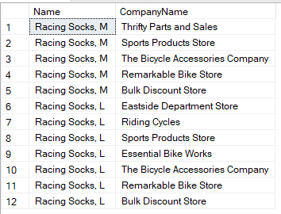

# Exercice

## 1. Retrouver le prénom et l'adresse email du client qui a pour nom de compagnie, 'Bike World'   
<br/>

```SQL
SELECT FirstName, EmailAddress
FROM SalesLT.Customer
WHERE CompanyName = 'Bike World'
```
> 
    Kerim	kerim0@adventure-works.com  
>

<br/><br/>

## 2. Retrouver les noms de compagnies qui ont pour ville 'Dallas'
<br/>

```SQL
SELECT C.CompanyName 
FROM SalesLT.Customer as C
JOIN SalesLT.CustomerAddress as CA ON CA.CustomerID = C.CustomerID
JOIN SalesLT.Address as A ON A.AddressID = CA.AddressID
WHERE A.City = 'Dallas'
```
>
    Unsurpassed Bikes
    Third Bike Store
    Town Industries
    Rental Bikes
    Elite Bikes
    Elite Bikes 
>

<br/><br/>


## 3. Combien de produits avec un prix > 1000$ ont été vendues
<br/>

```SQL
SELECT SUM(OrderQty)
FROM SalesLT.SalesOrderDetail as SOD
WHERE SOD.UnitPrice > 1000
```
> 
    290
>
<br/><br/>

## 4. Retrouver les companies dont les clients  ont commandés pour plus de 10.000$ (en incluant le sous-total, les taxes et les frais de transport)
<br/>

```SQL
SELECT C.CompanyName
FROM SalesLT.Customer C, SalesLT.SalesOrderHeader SOH
WHERE C.CustomerID = SOH.CustomerID AND SOH.TotalDue >= 10000
```
- La même requête mais ordinné -+ et requete plus propre

```SQL
SELECT C.CompanyName, SUM(SOH.SubTotal) as SubTotal, SUM(SOH.TaxAmt) as TaxAmt, SUM(SOH.Freight) as Freight, SUM(SOH.TotalDue) as TotalDUE
FROM SalesLT.Customer AS C
JOIN SalesLT.SalesOrderHeader AS SOH ON SOH.CustomerID = C.CustomerID
GROUP BY C.CompanyName
HAVING SUM(SOH.TotalDue) > 10000
ORDER BY TotalDue
```
  


<br/><br/>

## 5. Retrouver le nombre de chaussettes de courses commandées par la société 'Riding Cycles'  
<br/>

```SQL
SELECT SUM(SOD.OrderQty)
FROM SalesLT.SalesOrderDetail AS SOD
JOIN SalesLT.SalesOrderHeader AS SOH ON SOH.SalesOrderID = SOD.SalesOrderID
JOIN SalesLT.Customer AS C ON C.CustomerID = SOH.CustomerID
JOIN SalesLT.Product AS P ON P.ProductID = SOD.ProductID
WHERE C.CompanyName = 'Riding Cycles' AND P.Name = 'Racing Socks%'
```  
Retourne NULL

<br/><br/>


## 6. Une « commande d'article unique » est une commande client pour laquelle un seul article est commandé. Affichez le SalesOrderID et le UnitPrice pour chaque commande d'article unique.
<br/>

```SQL
SELECT SOD.SalesOrderID
FROM SalesLT.SalesOrderDetail as SOD
JOIN SalesLT.SalesOrderHeader as SOH ON SOH.SalesOrderID = SOD.SalesOrderID
WHERE SOD.OrderQty = 1
```  

 
|-|SalesOrderID|UnitPrice|
|---|:-:|--:|
|1|71774|356,898|
|...|...|...|
|128|71946|31,584|

>
<br/><br/>

## 7. Retrouvez le nom du produit et le nom de la compagnie pour les clients ayant commandés le produit 'Racing Socks'  
<br/>

```SQL
SELECT P.Name, C.CompanyName
FROM SalesLT.Product as P
JOIN SalesLT.ProductModel as PM ON PM.ProductModelID = P.ProductModelID
JOIN SalesLT.SalesOrderDetail as SOD ON SOD.ProductID = P.ProductID
JOIN SalesLT.SalesOrderHeader as SOH ON SOH.SalesOrderID = SOD.SalesOrderID
JOIN SalesLT.Customer as C ON C.CustomerID = SOH.CustomerID
WHERE PM.Name = 'Racing Socks'
```

>

<br/><br/>

## 8. Retrouver la description du produit avec l'identifiant 736 pour la langue française.
<br/>

Surement un peu long, a revoir
```SQL
SELECT PD.Description
FROM SalesLT.ProductDescription as PD
JOIN SalesLT.ProductModelProductDescription AS PMPD ON PMPD.ProductDescriptionID = PD.ProductDescriptionID
JOIN SalesLT.ProductModel as PM ON PM.ProductModelID = PMPD.ProductModelID
JOIN SalesLT.Product as P ON P.ProductModelID = PM.ProductModelID
WHERE P.ProductID = 736 AND PMPD.Culture = 'fr'
```  
 
>Le cadre LL en aluminium offre une conduite confortable, une excellente absorption des bosses pour un très bon rapport qualité-prix.

<br/><br/>

## 9. En utilisant le SubTotal value dans SaleOrderHeader, lister les commandes de la plus petite à la plus grande. Pour chaque commande, listez le nom de la compagnie, le sous total et le poids total de la commande
<br/> 

```SQL
SELECT  C.CompanyName, SOH.SubTotal, SUM(P.Weight) as TotalWeight
FROM SalesLT.SalesOrderHeader as SOH
JOIN SalesLT.SalesOrderDetail as SOD ON SOD.SalesOrderID = SOH.SalesOrderID
JOIN SalesLT.Product as P ON P.ProductID = SOD.ProductID
JOIN SalesLT.Customer as C ON C.CustomerID = SOH.CustomerID
GROUP BY C.CompanyName, SOH.SubTotal
ORDER BY SOH.SubTotal
```  
<br/>

## 10. Retrouver combien de produits avec la catégorie 'Cranksets' ont été vendues à une adresse à Londres.
<br/>

```SQL
SELECT COUNT(P.ProductID)
FROM SalesLT.SalesOrderHeader as SOH 
JOIN SalesLT.CustomerAddress as CA ON CA.CustomerID = SOH.CustomerID
JOIN SalesLT.Address as A ON A.AddressID = CA.AddressID
JOIN SalesLT.SalesOrderDetail as SOD ON SOD.SalesOrderID = SOH.SalesOrderID
JOIN SalesLT.Product as P ON P.ProductID = SOD.ProductID
JOIN SalesLT.ProductCategory as PC ON PC.ProductCategoryID = P.ProductCategoryID
WHERE A.City = 'Londre' AND PC.Name  = 'Cranksets'
```

11. Pour chaque client avec un 'Main Office' à Dallas, retrouvez la première ligne de l'adresse de livraison. Si aucune adresse n'existe, laissez là vide. N'ayez qu'une seule ligne par client.
<br/><br/>

12. Pour chaque vente, retrouvez le SalesOrderID et le sous-total, calculé à partir des 3 façons suivantes : depuis le SalesOrderHeader, la somme des OrderQty*UnitPrice et la somme des OrderQty*ListPrice
<br/><br/>

13. Retrouvez l'article le plus vendu, par valeur.
<br/><br/>

14. Retrouvez combien de commandes sont dans les intervals suivants : 0-99, 100-999, 1000-9999, 10000
<br/><br/>

15. Retrouvez les trois villes les plus importantes. Affichez la répartition de la catégorie de produits de premier niveau par rapport à chaque ville.
<br/><br/>
